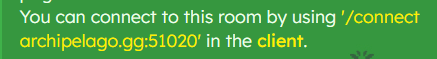
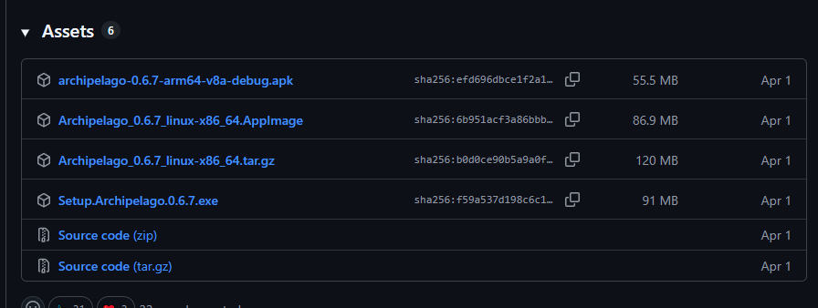
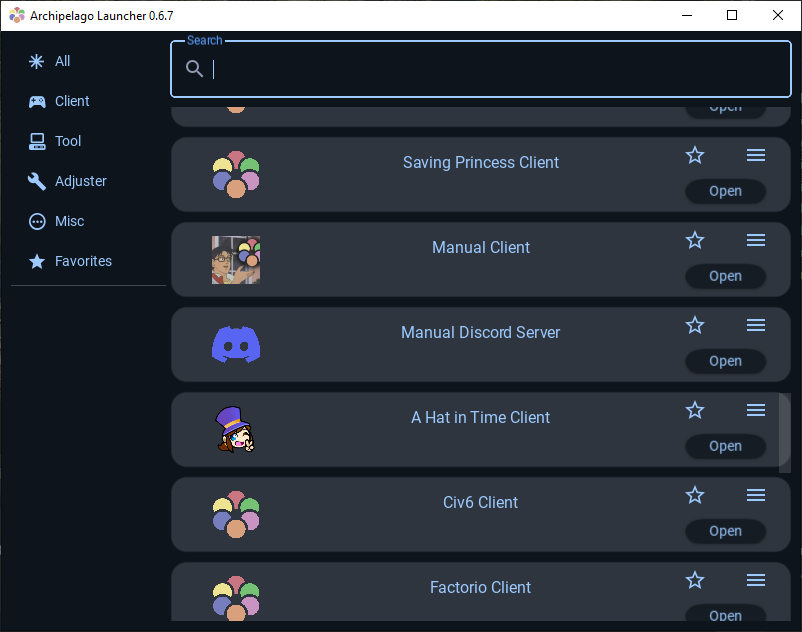
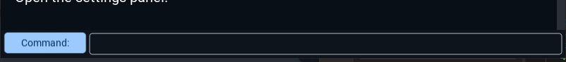
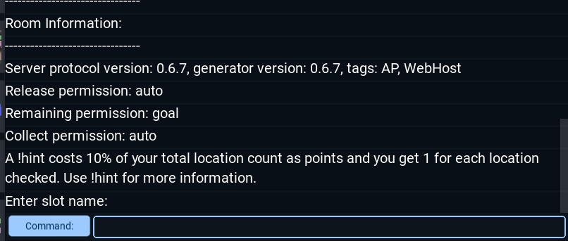
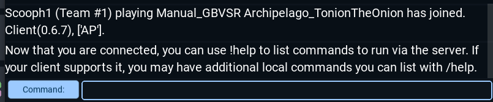

## How to set up the GBVSR Manual
- Open the [Host Game](https://archipelago.gg/uploads) page in Archipelago.gg, and upload the zip file in this repository. This will make Archipelago host the multiworld without any extra setup from your part.
- Create a new room, and take note of the "You can connect" message. Copy the command in single quotes.

- Download the [Archipelago Client](https://github.com/ArchipelagoMW/Archipelago/releases/tag/0.6.7). The multiworld has been generated using the version 0.6.7.
- The changelog is pretty long, so you need to scroll down and find this "Assets" section as pictured. Download and install the "Setup Archipelago" exe.

- Launch the Archipelago Launcher, and scroll to find "Manual Client". This will let you interact with the other players, sending and receiving items as you play through your manual.

- In the Client, locate the textbox next to "Command" and type `/connect archipelago.gg:port`. The `port` is the number in the single quotes that you should have noted. Type it and press Enter. 

- You will be asked to provide a slot name, which is basically your username. Just type it and press Enter.

- You're all set. Now you can start making progress in your playthrough.

## The Manual
- You'll start in a Location called "Arcade Mode 1", which will require you to complete your specified Arcade Mode run before proceeding.
- Basically, you'll be required to complete:
* Arcade Mode
* Survival Mode levels
* Combo Trials
* Story Mode

Have fun!
